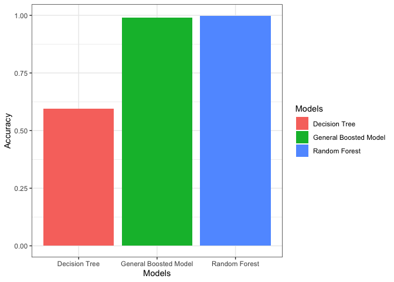

Overview
--------

This assignment is part of “Coursera’s practical machine learning”
course. The project is based on the data from a Human Activity
Recognition (HAR) study. The study used to quantify how well people do
an activity using the data from the sensors attached to the
participant’s body or equipment. To complete this assignment, we need to
use that data and to predict how the participants exercised.

Data
----

The training data for this project are available here:

<a href="https://d396qusza40orc.cloudfront.net/predmachlearn/pml-training.csv" class="uri">https://d396qusza40orc.cloudfront.net/predmachlearn/pml-training.csv</a>

The test data are available here:

<a href="https://d396qusza40orc.cloudfront.net/predmachlearn/pml-testing.csv" class="uri">https://d396qusza40orc.cloudfront.net/predmachlearn/pml-testing.csv</a>

The data for this project come from this source:
<a href="http://web.archive.org/web/20161224072740/http:/groupware.les.inf.puc-rio.br/har" class="uri">http://web.archive.org/web/20161224072740/http:/groupware.les.inf.puc-rio.br/har</a>.

Packages required & Data Preprocessing
--------------------------------------

First, I will load all the packages required and the data for analysis.
Also, I will partition the training data set in two parts: 70 % for
training and 30% as a test data set.

``` r
library(knitr)
library(caret)
```

    ## Loading required package: lattice

    ## Loading required package: ggplot2

``` r
library(randomForest)
```

    ## randomForest 4.6-14

    ## Type rfNews() to see new features/changes/bug fixes.

    ## 
    ## Attaching package: 'randomForest'

    ## The following object is masked from 'package:ggplot2':
    ## 
    ##     margin

``` r
library(gbm)
```

    ## Loaded gbm 2.1.5

``` r
library(rpart)
library(rpart.plot)
library(ggplot2)
set.seed(202003)

# Data
training <-  read.csv("~/Desktop/pml-training.csv")
testing <- read.csv("~/Desktop/pml-testing.csv")

# creating data partition
# Will use 70% of dataset as training and 30% as test
inTrain  <- createDataPartition(training$classe, p=0.7, list=FALSE)
Train <- training[inTrain, ]
Test  <- training[-inTrain, ]
dim(Train); dim(Test)
```

    ## [1] 13737   160

    ## [1] 5885  160

Now, as I created partition and by checking the dimensions, we know both
datasets have 160 variables. These variables contain a lot of NA values
that we need to remove. We will remove the near-zero variance as well.
We can do it as following by only selecting the columns that don’t have
NA’s:

``` r
# Cleaning the dataset

# Removing near zero variance
nearzv <- nearZeroVar(Train)
Train <- Train[, -nearzv]
Test  <- Test[, -nearzv]

dim(Train); dim(Test)
```

    ## [1] 13737   108

    ## [1] 5885  108

``` r
# Selecting only columns without NAs
Train <- Train[ , colSums(is.na(Train)) == 0] 
Test <- Test[ , colSums(is.na(Test)) == 0]

dim(Train); dim(Test)
```

    ## [1] 13737    59

    ## [1] 5885   59

``` r
# Removing coulmns (1-5) with identification only variables
Train <- Train[, -(1:5)]
Test  <- Test[, -(1:5)]
dim(Train); dim(Test)
```

    ## [1] 13737    54

    ## [1] 5885   54

Model Building
--------------

After cleaning the data, I will then build the prediction model. I will
try three different models, including random forest, generalized boosted
model(gbm), and decision tree. I will use the out of sample error to
cross-validate the models.

### a) Random Forest:

I will use the Random Forest method from “caret” package with default
parameters and a 5 fold cross validation. \`the coulmn “classe” will be
used as the dependent and all other vaiables as predictors.

``` r
set.seed(202003)
controlT <- trainControl(method = "cv", number = 5, verboseIter=FALSE)
RF <- randomForest(classe ~ ., data = Train, trControl = controlT, importance = TRUE)
pred_rf <- predict(RF, newdata= Test)
# To check the accuracy of model
RF_confM <- confusionMatrix(pred_rf, Test$classe)$overall[1]
```

### b) Generalized boosted model(gbm):

``` r
set.seed(202003)
GBM <- train(classe ~ ., data = Train, method = "gbm", verbose = FALSE)
pred_gbm <- predict(GBM, newdata = Test)
# To check the accuracy of model
GBM_confM <- confusionMatrix(pred_gbm, Test$classe)$overall[1]
```

### c) Decision tree:

``` r
set.seed(202003)
DT <- train(classe ~ ., data=Train, method="rpart")
# Prediction on test data
predDT <- predict(DT, newdata=Test)
DT_confM <- confusionMatrix(predDT, Test$classe)$overall[1]
```

Out of Sample Error
-------------------

To assess the model accuracy and prediction, the ‘confusion matrix’ was
calculated using the caret’s function ‘confusion matrix’ for all the
models.

``` r
confM <- c(RF_confM, GBM_confM, DT_confM)
models <- c("Random Forest", "General Boosted Model", "Decision Tree")
ModelAccuracy <- data.frame(Models = models,
                Accuracy = confM)
print(ModelAccuracy)
```

    ##                  Models  Accuracy
    ## 1         Random Forest 0.9981308
    ## 2 General Boosted Model 0.9903144
    ## 3         Decision Tree 0.5960918

``` r
ggplot(ModelAccuracy, aes(x = Models, y = Accuracy)) + 
  geom_bar(stat = "identity", aes(fill = Models)) +
  theme_bw()
```



From the result, we can see that both the random forest and general
boosting model perform better than the decision tree. The random forest
model slightly shows better accuracy than the generalized boosted model.
Also, the out of sample error is \~ 0.18% that is good enough to use
this model for the quiz section. So for the quiz section, I will use the
random forest model on the Test dataset given for the assignment quiz.
